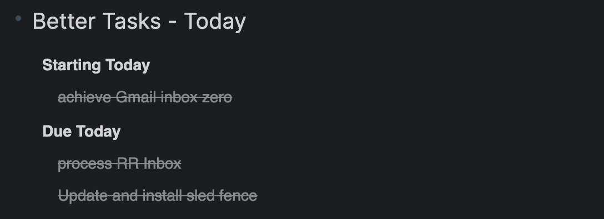

# 🌀 Better Tasks for Roam Research
**The missing task layer for Roam.**  
Turn native TODOs into **scheduled and recurring tasks** with **inline pills**, a **powerful dashboard**, and optional **Today widget/badge** — all stored as plain Roam blocks.

> ✅ Roam-native storage (child blocks) • ✅ Recurring + one-off scheduled tasks • ✅ Actively maintained

**Support / bugs:** Please message me in the Roam Slack (include repro steps + any console output if relevant):  
https://app.slack.com/client/TNEAEL9QW/

---

## What it looks like (start here)

  

**90-second tour (recommended to re-record as the “current” overview):**  

**Repeat rules demo:**  

---

## Why Better Tasks

If you use TODOs in Roam, Better Tasks gives you:

- **Recurring tasks** that spawn the next occurrence when completed
- **Start / Defer / Due** dates for scheduled one-off tasks
- **Inline pills** for fast editing, snoozing, and jumping to DNPs
- A **dashboard** for review & triage, **saved views**, and **weekly review presets**
- Optional **Today widget** (on today’s DNP) and **Today badge** (left sidebar)
- Optional metadata: **Project, Context, Waiting-for, GTD, Priority, Energy**

---

## Quick start (2 minutes)

1. **Convert an existing TODO**  
   Cursor on a TODO → Command Palette → **Convert TODO to Better Task**

2. **Or create one from scratch**  
   Command Palette → **Create a Better Task**

3. **Add scheduling / recurrence**  
   Add a **repeat rule** (e.g. `every Friday`) and/or **start / defer / due** dates.

---

## 📘 Roam-native storage (reliable & reversible)

Better Tasks stores canonical data in **child blocks** (attribute names configurable; defaults shown).

### Recurring task (child block style)

    {{[[TODO]]}} Write weekly newsletter
      - BT_attrRepeat:: every Friday
      - BT_attrDue:: [[2025-11-07]]

When completed:

    {{[[DONE]]}} Write weekly newsletter
      - BT_attrRepeat:: every Friday
      - BT_attrDue:: [[2025-11-07]]
      - BT_attrCompleted:: [[2025-10-31]]

Optional attributes:
- `BT_attrStart::` — when the task becomes available
- `BT_attrDefer::` — when it should resurface
- `BT_attrCompleted::` — written on completion

✅ Disable Better Tasks anytime — your tasks remain plain Roam blocks.

---

## Scheduled (one-off) tasks

Leave the repeat field blank while setting any combination of `start::`, `defer::`, or `due::`.

- Same pills, snooze controls, and dashboard support
- No follow-up task is spawned
- Completion writes `completed:: [[<today>]]` and hides the pill

---

## Optional metadata

    - BT_attrProject:: [[Website Refresh]]
    - BT_attrGTD:: Next Action
    - BT_attrWaitingFor:: [[Finance Team]]
    - BT_attrContext:: @computer, #office
    - BT_attrPriority:: high
    - BT_attrEnergy:: medium

Metadata appears both inline (pill) and in the dashboard.

Interactions:
- Click → open page
- Shift+Click → open in right sidebar
- Cmd/Ctrl+Click → edit value

GTD cycles: **Next → Delegated → Deferred → Someday → cleared**  
Priority / Energy cycles: **low → medium → high → none**

---

## 💊 Inline pills

  

- Pills hide when the task is expanded; reappear when collapsed
- Completed tasks stay visually quiet until the next recurrence
- Non-recurring tasks still show date pills

Common actions:
- **↻ Repeat** — click to edit; Alt+Click to copy
- **⏱ Start / ⏳ Defer / 📅 Due** — click to open DNP  
  Shift+Click opens in sidebar
- **Alt/Ctrl/Meta+Click** opens date picker
- **⋯ Menu** opens the full task menu

---

## 🧩 Pill menu actions

| Action | Description |
|------|-------------|
| Snooze +1 day | Push start date forward 1 day |
| Snooze +3 days | Push start date forward 3 days |
| Snooze to next Monday | Move start to next Monday |
| Snooze (pick date) | Choose a custom date |
| Skip this occurrence | Jump to next repeat |
| Generate next now | Create next task immediately |
| End recurrence | Stop repeating |

All actions support **Undo**.

---

## 📊 Better Tasks dashboard

Open via Command Palette → **Toggle Better Tasks Dashboard**  or the top-bar icon 

  

Features:
- Filters: recurrence, availability, due buckets, completion
- Quick snooze / complete actions
- Jump back to original blocks
- Draggable floating panel (position remembered)
- Optional **full-page mode** with persistent filter sidebar
- Metadata chips + filtering
- Quick-add input (uses AI parsing if enabled)

### Full-page mode

  

---

## 🗓 Today widget & Today badge (optional)

### Today widget (on today’s DNP)

  

### Today badge (left sidebar)

  

---

## ⚙️ Settings (progressive disclosure)

  

Core settings:
- Language
- Destination for next task
- Confirm before spawning
- First day of week
- Inline pill checkbox threshold (performance guard)

Additional sections appear only when enabled.

---

## 🤖 AI task input parsing (experimental)

- Optional BYO OpenAI key (client-side only)
- Maps natural language into repeat/dates
- Falls back safely if parsing fails
- No backend, no graph data sent

---

## 🧭 Commands

- Convert TODO to Better Task
- Create a Better Task
- Toggle Better Tasks Dashboard
- Toggle Dashboard (Full page)
- Switch / Save views
- Reinstall preset views
- Weekly Review

---

## ⚡ Performance notes

Recent versions include memory and render optimisations.

If Roam feels slow:
1. Disable **Today Widget**
2. Disable **Today Badge**
3. Message me in Slack with task count + details

---

## 🌍 Internationalisation

Supported:
- English (en)
- Simplified Chinese (zh)
- Traditional Chinese (zhHant)

UI is fully locale-aware.  
Natural-language recurrence parsing is intentionally English-only for now.

---

Enjoy Better Task management directly inside Roam Research!
